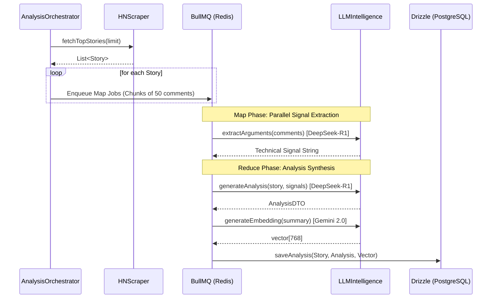
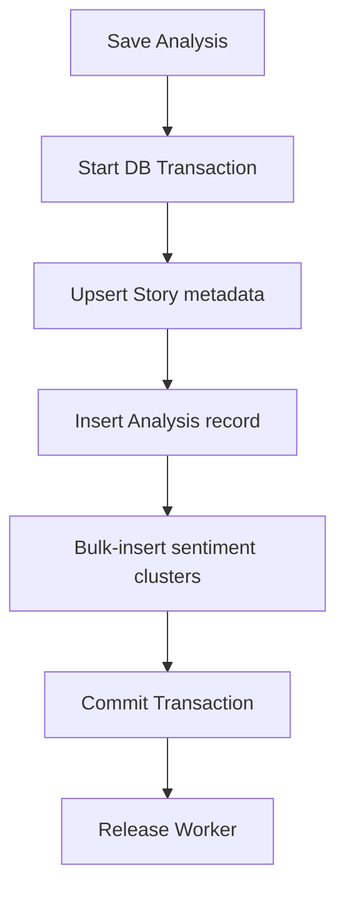

# Mechanism Deep-Dive: HN Digest Core Flows

## 1. Map-Reduce Inference Flow (Resilient Pipeline)
This flow coordinates the asynchronous processing of HN stories into technical briefings.

### Key Implementation Details:
- **Map Phase**: Uses `deepseek-reasoner` for high-fidelity extraction from comment chunks.
- **Reduce Phase**: Synthesis of final report using `deepseek-reasoner`.
- **Embeddings**: Standardized on 768-dimension vectors using `gemini-embedding-001`.
- **JSON Repair**: The `LLMIntelligence` module uses `json-repair` to handle trailing commas or malformed structure before Zod validation.

## 2. Data Persistence Mechanism
We use Drizzle ORM transactions to ensure "all-or-nothing" consistency for analysis results.

## 3. Scraper Extraction Logic (Fallback Loop)
The scraper ensures 100% extraction even behind paywalls or complex JS sites.

1. **Trafilatura CLI (Python)**: Primary extraction (high metadata quality).
2. **Cheerio/Markdown Fallback**: Secondary extraction if Trafilatura fails.
3. **HN Context**: If both fail, we fallback to the summary provided in the HN top comments.
