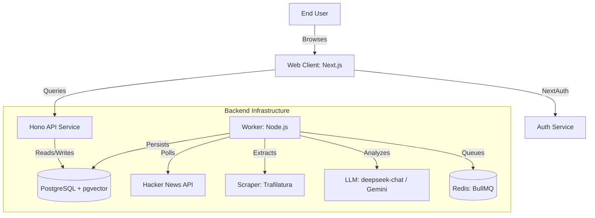

# Technical Specification: HN Digest "Modern Broadside"

## 1. System Overview
HN Digest is a containerized, AI-driven pipeline for analyzing and summarizing Hacker News stories. It follows a **Hexagonal Architecture** for the worker and a **Next.js + Hono** architecture for the web/API.

## 2. Top-Down Architecture (C4 Context)

## 3. Worker Component Detail (Hexagonal Blueprint)

### A. Domain Layer (`worker/src/domain`)
- **Models**: Defines the immutable business entities: `Story`, `Comment`, `Analysis`, `SentimentCluster`.
- **Ports**: Functional contracts for external dependencies.
    - `StoryProvider`: Fetching raw data.
    - `IntelligenceProvider`: AI synthesis and embeddings.
    - `AnalysisRepository`: Data persistence and verification.

### B. Application Layer (`worker/src/application`)
- **AnalysisOrchestrator**:
    - Coordinates the "Map-Reduce" flow via BullMQ.
    - Logic: `Scrape` -> `Chunk Comments` -> `Enqueue Map Jobs` -> `Wait for Completion` -> `Reduce Job` -> `Persist`.

### C. Infrastructure Layer (`worker/src/infrastructure`)
- **HNScraper**: Handles resilient fetching from HN Firebase API. Includes Trafilatura CLI integration for article extraction.
- **LLMIntelligence**: deepseek-chat (Reasoner) for technical extraction. Gemini 2.0 Flash for embeddings and fallback.
- **DrizzleAnalysisRepository**: Uses Drizzle ORM to manage `pgvector` and standard relational tables.
- **BullMQQueue**: Manages the Redis-backed job queues with OpenTelemetry tracing.

## 4. API Component Detail (Hono Backend)

### A. Routing & Middleware
- **Path**: `app/src/app/api/[[...route]]/route.ts`
- **Middleware**: Structured logging (Pino), trace-id generation, and health checks.
- **Endpoints**:
    - `GET /v1/digests/manifest`: Returns available digest dates.
    - `GET /v1/digests/daily/latest`: Returns the most recent AI-summarized digest.
    - `POST /v1/bookmarks`: Toggles story bookmark status.
    - `DELETE /v1/bookmarks/:id`: Removes a bookmark.

## 5. Persistence Layer Detail
- **Database**: PostgreSQL 16.
- **Vector Search**: `pgvector` with 768 dimensions (Gemini-native).
- **Hardening**: SQL `CHECK` constraints on sentiment types and source enums at the DB level.
