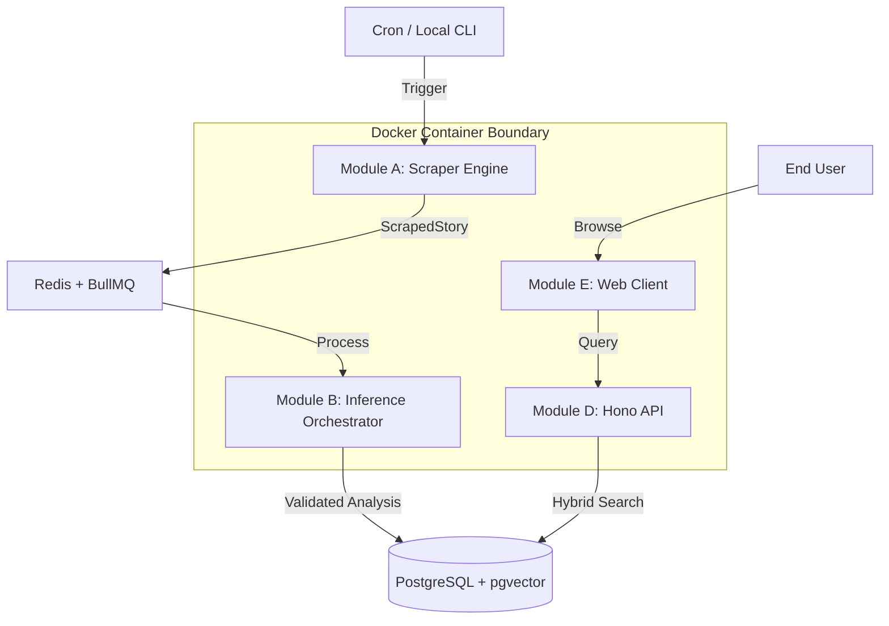

# System Architecture: "The Intelligence Broadside"
**Objective:** A containerized, cloud-native pipeline for HN story analysis with 100% local parity.

## 1. Environment Parity (Local vs. Production)
To ensure "Deployment from Day 1," we maintain identical logic in both environments via Docker.

### Local Environment (100% Verified Locally)
-   **Orchestration:** `docker-compose.yml` managing:
    -   `app`: Next.js frontend & Hono API.
    -   `worker`: Scraper & Inference Orchestrator (BullMQ worker).
    -   `db`: PostgreSQL 16 + `pgvector`.
    -   `redis`: Local Redis (for BullMQ queues).
-   **Verification:** Local tests run against these containers.

### Production Environment
-   **Platform:** Vercel (Frontend/API) + AWS ECS/Fly.io (Worker).
-   **DB:** Managed PostgreSQL (Supabase/Neon).
-   **Queue:** Managed Redis (Upstash Redis or ElastiCache).
-   **CI/CD:** GitHub Actions triggers on every commit, building Docker images and running local-parity tests before deployment.

## 2. High-Level Diagram

## 3. Technology Stack (Finalized)
-   **Frontend:** Next.js 15 (App Router).
-   **API:** Hono (integrated with Next.js Route Handlers).
-   **Queue:** BullMQ + Redis (for 100% local/prod parity).
-   **Database:** PostgreSQL + Drizzle ORM.
-   **AI:** Gemini 2.0 Flash (Primary), DeepSeek-V3 (Fallback).
