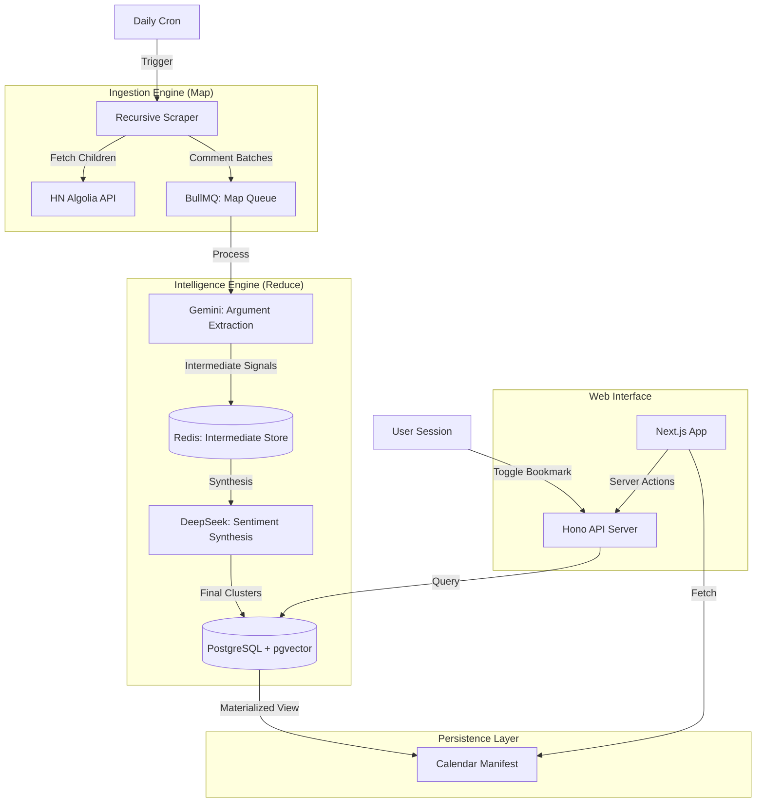

# Mission 2 Architecture: "The Intelligence Engine"
**Objective:** Evolve from a linear pipeline to a multi-stage, event-driven system with stateful user interactions.

## 1. Current vs. Future State

| Component | V1 (Current) | V2 (Mission 2) | Rationale |
| :--- | :--- | :--- | :--- |
| **Auth** | Mock Credentials | Argon2id + JWT | Production-grade security. |
| **Comments** | Top 25 (Shallow) | Exhaustive Recursive Tree | Deep technical sentiment accuracy. |
| **Pipeline** | Linear Loop | Map-Reduce Orchestration | Handle massive comment context. |
| **Navigation** | "Latest" Only | Manifest-Driven Calendar | Scalable historical discovery. |
| **Data Flow** | One-way Push | Bidirectional State | Support Bookmark Toggles (On/Off). |

## 2. Comprehensive System Diagram

## 3. Tech Stack Refinements (SOTA)
*   **Crypto:** `argon2` for hashing (winner of PHC).
*   **Caching:** `Incremental Materialized Views` in Postgres for the Calendar Manifest (sub-millisecond retrieval).
*   **Queueing:** BullMQ `Parent/Child` dependencies for Map-Reduce logic.
*   **Vector Search:** `pgvector` HNSW index for high-speed semantic retrieval as data grows.
