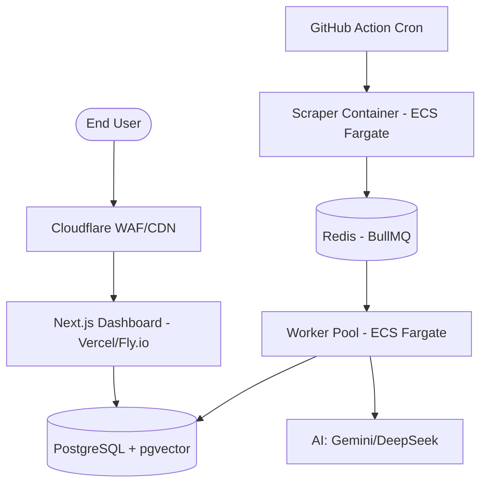

# Mission 3: Deployment Scheme

## 1. High-Level Traffic Topology

## 2. Environment Strategy
*   **Local:** `docker-compose` with `MOCK_LLM=true` option.
*   **Staging:** Identical to production but with smaller DB instances and restricted access.
*   **Production:** Full scaling, encrypted-at-rest DB, and global CDN.

## 3. Health & Readiness Gates
The system will implement three critical health endpoints:
1.  **`/api/health/live`:** Returns `200 OK` if the process is running.
2.  **`/api/health/ready`:** Returns `200 OK` only if Postgres and Redis connections are established.
3.  **`/api/health/consistency`:** Performs the Mission 2.5 integrity audit (orphaned rows check).

## 4. Disaster Recovery (DR)
*   **Backups:** Automated RDS snapshots every 24 hours.
*   **Point-in-Time Recovery:** Ability to restore the DB to any second within the last 7 days.
*   **Worker Idempotency:** If a worker fails mid-job, BullMQ ensures it is re-run. Since our insertions use `ON CONFLICT DO UPDATE`, no duplicate stories will be created.
