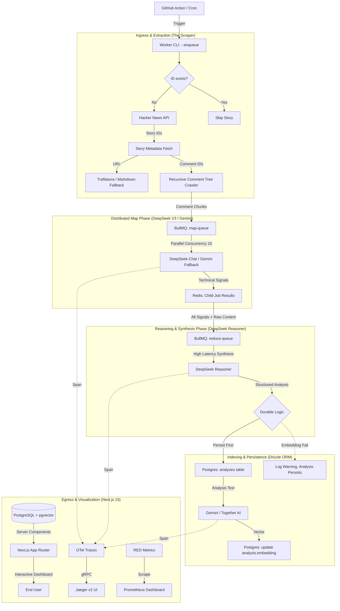

# Mission 3: Comprehensive Data Flow & System Architecture

## 1. System Topology Overview
The `hn-digest` system is a distributed, event-driven intelligence engine. It utilizes a **Map-Reduce** pattern to parallelize the extraction of community signals and a **Reasoning-First** approach to synthesize technical briefs.

## 2. Component Specifications

### A. The Scraper (Resilient & Respectful)
- **Primary:** `trafilatura` (Python bridge).
- **Secondary Fallback:** `node-html-markdown` (Direct HTTP fetch).
- **Ethics:** Strict 1s inter-story and 250ms inter-comment delays with User-Agent mirroring.
- **Incremental Logic:** High-efficiency ID filtering against DB before fetching metadata.

### B. The Map Phase (High Throughput)
- **Primary Model:** `deepseek-chat` (V3).
- **Fallback Model:** `gemini-2.0-flash`.
- **Concurrency:** **10 parallel jobs** (unthrottled for DeepSeek, exponential backoff for Gemini).
- **Function:** Compresses 50+ comments into raw technical arguments (Signals).

### C. The Reduce Phase (Reasoning-First)
- **Model:** `deepseek-reasoner`.
- **Logic:** Chain-of-Thought synthesis of Article + Community Signals.
- **Durability:** **Durable Synthesis** pattern ensures analysis is saved even if secondary steps fail.

### D. The Indexing Phase (Graceful Degradation)
- **Model:** `gemini-embedding-001` or `togethercomputer/m2-bert-80M`.
- **Control:** Toggled via `EMBEDDING_PROVIDER` env var.
- **Fault Tolerance:** Non-blocking step; failure logs a warning but preserves the UI content.

### E. The UI & Observability
- **Frontend:** Next.js 15 RSC + Tailwind CSS ("Broadside" Aesthetic).
- **Logging:** Structured JSON via `Pino` with `traceId` correlation.
- **Tracing:** OTel gRPC -> Jaeger v2 (Service Performance Monitoring enabled).
- **Metrics:** Prometheus scraping SpanMetrics for real-time RED visualization.

## 3. Data Integrity Constraints (Hardened)
- **Drizzle Schema:** Enforced DB-level enums and `CHECK` constraints.
- **Concurrency:** Parallel orchestration (no artificial delay) proved via stress test.
- **Retries:** Exponential backoff (5s base) for all LLM jobs.
